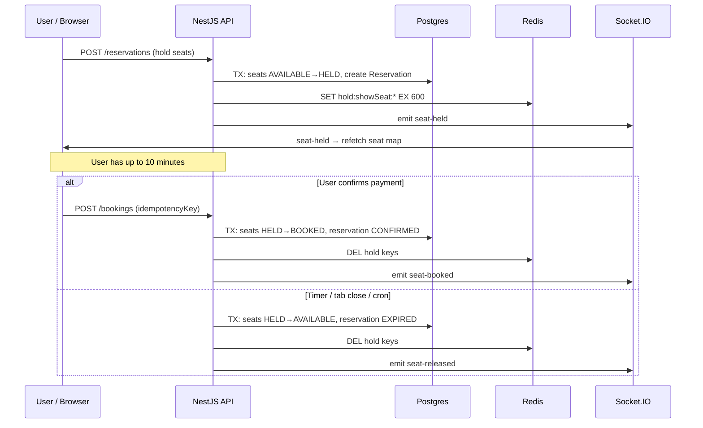

# BookMyShow — Core System Design

> **Audience:** Technical reviewer evaluating seat **hold**, **reservation**, **booking**, real-time updates, and the conversational booking agent.  
> **Scope:** What we built, how it works under normal and failure conditions, and why we stopped short of distributed messaging (Kafka, etc.).

---

## 1. Executive summary

BookMyShow is a **two-package monorepo** (`backend/` NestJS API + `frontend/` Next.js app) that implements a full ticketing flow:

1. Browse movies and showtimes  
2. Select seats on a live seat map  
3. **Hold** seats for a bounded time (default **10 minutes**)  
4. Confirm into a **booking**  
5. Optionally **cancel** holds or confirmed bookings  

The system uses **Postgres as the source of truth**, **Redis for ephemeral coordination** (hold keys, agent sessions, turn locks), and **Socket.IO** for push-based seat map refreshes. A **Gemini-powered booking agent** drives the same backend APIs through tools, with a deterministic **enrichment layer** that guarantees structured UI (dropdowns, seat picker, confirm buttons) even when the LLM misbehaves.

We deliberately chose a **modular monolith** over microservices and message buses. That is sufficient for demo-to-mid-scale traffic and keeps hold semantics easy to reason about in one database transaction.

---

## 2. Monorepo layout

```
bookmyshow/
├── backend/          # NestJS modular monolith (port 3001)
│   ├── src/
│   │   ├── catalog/       # Movies, theatres, shows, seat maps (read)
│   │   ├── reservation/   # Seat holds + expiry reconciliation
│   │   ├── booking/       # Confirm booking from hold, cancel booking
│   │   ├── realtime/      # Socket.IO gateway + emit helpers
│   │   ├── redis/         # Hold keys, shared Redis client
│   │   ├── agent/         # LLM loop, tools, session, enricher
│   │   └── auth/          # User upsert for checkout/agent
│   └── prisma/            # Schema, migrations, seed
├── frontend/         # Next.js App Router (port 3000)
│   ├── app/               # Pages (seat map, booking detail)
│   ├── components/booking-agent/  # Chat UI blocks
│   └── hooks/             # useBookingAgent, useShowSocket
└── docker-compose.yml  # Redis only (Postgres is external, e.g. Supabase)
```

**Why not multiple services?** Holds require **atomic seat state transitions** across reservation rows and `show_seat` rows. Keeping catalog, reservation, booking, and realtime in one process means one Prisma transaction boundary, one deployment unit, and no cross-service saga for “hold seat → pay → confirm.” Redis and WebSockets are **adjacent infrastructure**, not separate domain services.

---

## 3. Data model and seat lifecycle

### 3.1 Core entities

| Entity | Role |
|--------|------|
| `ShowSeat` | Per-show instance of a physical seat; carries `status`, `price`, and `version` |
| `Reservation` | A time-bounded hold (`ACTIVE` → `EXPIRED` or `CONFIRMED`) |
| `ReservationSeat` | Join table: which `ShowSeat` rows are held |
| `Booking` | Confirmed purchase linked 1:1 to a reservation |
| `BookingSeat` | Join table: which seats were booked |

### 3.2 Seat statuses

```
AVAILABLE  ──hold──►  HELD  ──confirm──►  BOOKED
     ▲                  │
     │                  │ expire / cancel hold
     └──────────────────┘

BOOKED  ──cancel booking──►  AVAILABLE
```

- **AVAILABLE** — selectable by any user.  
- **HELD** — tied to an `ACTIVE` reservation until expiry, explicit cancel, or successful booking.  
- **BOOKED** — permanently taken until a confirmed booking is cancelled.

### 3.3 Optimistic concurrency

Each `ShowSeat` has a `version` integer. State changes use **conditional updates**:

```typescript
await tx.showSeat.updateMany({
  where: { id, status: ShowSeatStatus.AVAILABLE, version },
  data: { status: ShowSeatStatus.HELD, version: { increment: 1 } },
});
// updated.count must be 1, else ConflictException
```

If two users race for the same seat, exactly one transaction wins; the other gets **409 Conflict**. No distributed lock per seat is required beyond this DB pattern.

---

## 4. Hold and reservation — deep dive

### 4.1 Default TTL: 10 minutes (600 seconds)

Defined in `ReservationService`:

```typescript
const HOLD_TTL_SECONDS = 600;
```

When a hold is created:

1. `expiresAt = now + holdTtlSeconds` is stored on the `Reservation` row.  
2. Matching `ShowSeat` rows flip `AVAILABLE → HELD` inside a **single Prisma transaction**.  
3. Redis keys are set: `hold:showSeat:{showSeatId} → reservationId` with the **same TTL** (`EX 600`).  

The client may override duration via `holdDurationSeconds` on the API (capped at 600 in the agent tool schema). For demos, `DEMO_FAST_HOLD=true` forces **10-second** holds on the backend; the frontend mirrors this with `NEXT_PUBLIC_DEMO_FAST_HOLD=true` for the checkout countdown.

### 4.2 Two layers of truth

| Layer | Purpose | What happens on expiry |
|-------|---------|-------------------------|
| **Postgres** | Authoritative seat status and reservation lifecycle | Cron + explicit checks mark reservation `EXPIRED`, seats `AVAILABLE` |
| **Redis** | Fast hold key mirror + agent session storage | Keys auto-expire via TTL; DB reconcile deletes any stragglers |

Postgres alone would eventually release seats via cron. Redis TTL gives **fast key eviction** and a cheap way to associate a seat with a reservation id without extra tables.

**Important:** Runtime catalog reads always come from **Postgres via Prisma**, not from seed files. `prisma/seed.ts` only populates demo data (`pnpm prisma:seed`).

### 4.3 Creating a hold (happy path)

**Manual UI path** (`POST /reservations`):

1. Validate all `showSeatIds` exist, belong to `showId`, and are `AVAILABLE`.  
2. Transaction: create `Reservation` + link seats + flip each seat to `HELD` with version check.  
3. `redis.setHoldKeys(showSeatIds, reservationId, ttl)`.  
4. `realtime.emitSeatHeld(showId, seatId, reservationId)` for each seat.  

**Agent path** (`holdSeats` tool → same `ReservationService.create`):

- Requires `session.userId` (via `upsertUser` first).  
- User selects seats in a `seat_picker` UI; frontend sends a JSON array of `showSeatId` UUIDs.  
- Enricher runs `tryCompleteHold` and injects a **confirm** prompt (“Confirm booking / Cancel”).

### 4.4 Confirming a booking

`BookingService.createFromReservation`:

1. **Idempotency:** `idempotencyKey` unique index — duplicate POST returns the same booking.  
2. Reject if reservation not `ACTIVE` or `expiresAt` in the past (triggers expire + **410 Gone**).  
3. Transaction: create `Booking`, flip seats `HELD → BOOKED`, reservation `ACTIVE → CONFIRMED`.  
4. Delete Redis hold keys (failure logged, non-fatal).  
5. Emit `seat-booked` on Socket.IO.

### 4.5 Cancelling

| User intent | Mechanism | Seat outcome |
|-------------|-----------|--------------|
| **Cancel hold** (checkout sheet close, timer expiry, agent “cancel” during hold) | `ReservationService.cancel` → `expireReservation` | `HELD → AVAILABLE`, reservation `EXPIRED` |
| **Cancel confirmed booking** | `BookingService.cancelBooking` | `BOOKED → AVAILABLE`, booking `CANCELLED` |
| **Agent `releaseHold` tool** | Same as cancel hold | Releases session’s `reservationId` |

Hold cancel and booking cancel are **intentionally separate** — the agent system prompt and enricher enforce this distinction.

---

## 5. Timer and expiry — how we never leak held seats

Holds are released through **four complementary mechanisms** (defense in depth):

### 5.1 Client-side countdown (manual checkout)

`CheckoutSheet` reads `expiresAt` from the reservation response and runs a 1-second interval. At `secondsLeft <= 0`, it calls `cancelReservationSafe` and notifies the seat map. This gives immediate UX when the user is staring at the payment sheet.

### 5.2 Server-side check at booking time

Before confirming, `BookingService` calls `isReservationExpired`. If expired, it runs `expireReservation` and returns **410 Gone** — the user cannot book stale holds.

### 5.3 Cron reconciliation (backstop)

`ReservationReconcileCron` runs on a configurable schedule (default: **every minute** via `RECONCILE_CRON_INTERVAL`):

1. Query up to **100** reservations where `status = ACTIVE` and `expiresAt < now`.  
2. For each, call `ReservationReconcileService.expireReservation`.  
3. Per-reservation failures are logged; the batch continues.  

This handles:

- User closed the tab without cancelling  
- Server crashed after hold but before Redis TTL alignment  
- Redis and DB drift  
- Any exceptional path that skipped client cleanup  

For faster demos, `.env.example` documents a 10-second cron: `RECONCILE_CRON_INTERVAL=*/10 * * * * *`.

### 5.4 What `expireReservation` does atomically

1. No-op if reservation is not `ACTIVE`.  
2. Transaction: reservation `→ EXPIRED`; each `HELD` seat `→ AVAILABLE` with version guard.  
3. `redis.deleteHoldKeys` for all held seat ids.  
4. `realtime.emitSeatReleased` per seat so all connected clients refetch.

If two workers try to expire the same reservation, `updateMany` count checks ensure **exactly-once** semantic effect.

### 5.5 When something goes wrong

| Failure | Behavior |
|---------|----------|
| Hold race (seat taken) | `409 Conflict`; agent enricher refreshes seat picker |
| Redis down during hold | Hold still committed in Postgres; cron + booking checks remain correct |
| Redis delete fails after booking | Logged warning; seat already `BOOKED` in DB — safe |
| Double booking POST | Idempotency key returns existing booking |
| Agent double-submit | Redis turn lock → **429** “Previous message still processing” |
| LLM skips UI picker | Enricher injects synthetic `uiPrompt` tool calls |

---

## 6. WebSocket real-time updates

### 6.1 Backend

- **Gateway:** `RealtimeGateway` — clients `join-show` / `leave-show` rooms named `show:{showId}`.  
- **Service:** `RealtimeService` emits:
  - `seat-held` — `{ showId, seatId, reservationId }`
  - `seat-released` — `{ showId, seatId }`
  - `seat-booked` — `{ showId, seatId, bookingId }`

Emitted after successful DB writes in reservation, reconcile, and booking services.

### 6.2 Frontend

`useShowSocket(showId)`:

1. Joins the show room on mount.  
2. Listens for all three events.  
3. Invalidates React Query key `['show-seats', showId]` → seat map refetches.  

No custom diff protocol — **simple event → refetch** keeps clients consistent with Postgres without maintaining a replicated seat state machine in the browser.

### 6.3 Scalability note for WebSockets

This pattern scales to **one Node process** with Socket.IO’s room model. Horizontal scaling would require a Redis adapter for Socket.IO (sticky sessions or shared pub/sub). We have not added that yet because it is unnecessary below roughly **tens of thousands of concurrent connections per region** for a demo/MVP, and the reviewer’s focus is hold correctness—not multi-region fanout.

---

## 7. Conversational booking agent

### 7.1 Request flow

```
User message (frontend)
    │
    ▼
POST /agent/chat
    │
    ├─ acquireTurnLock(sessionId)     ──► 429 if busy
    │
    ├─ load/save AgentSession (Redis hash, TTL 30 min)
    │
    ├─ runAgentLoop (Gemini 2.5 Flash, max 2 tool steps)
    │     └─ tools: listMovies, listShows, getSeatMap, holdSeats,
    │              confirmBooking, cancelBooking, releaseHold, uiPrompt, …
    │
    ├─ enrichToolCalls (deterministic post-processor)
    │     └─ injects uiPrompt / uiMarkdown when LLM omits them
    │
    ├─ filterClientToolCalls (hide raw listMovies/listShows/getSeatMap)
    │
    └─ releaseTurnLock
```

### 7.2 Why two phases: LLM loop + enricher?

LLMs are non-deterministic. The enricher (`enrichToolCalls.ts`) is **server-side control logic** that:

- Guarantees a **movie dropdown** after `listMovies` (Rule 1)  
- Shows **date chips** after movie UUID selection (Rule 2, 2b)  
- Shows **showtime dropdown** after date (Rules 3–4)  
- Shows **seat picker** after `getSeatMap` (Rule 5)  
- Completes **hold + confirm** after seat JSON (Rule 6, 6b)  
- Renders **ticket markdown + redirect** after confirm (Rule 7)  
- Handles **hold cancel** vs **booking cancel** (Rules 8–12)  

If the model returns an empty turn on “what movies are playing?”, a **safety net** still fetches movies and renders the picker.

### 7.3 Session state (Redis)

`AgentSession` tracks: `userId`, `movieId`, `selectedDate`, `showId`, `reservationId`, `pendingCancelBookingId`, and message history.

- Stored as Redis hash `agent:session:{sessionId}`, TTL **30 minutes**.  
- Turn lock: `agent:lock:{sessionId}` with **30-second** NX lock prevents concurrent messages corrupting session state.

### 7.4 Frontend chat

- **Hook:** `useBookingAgent` — sends messages, parses `toolCalls` into `UiBlock[]` (`choice_group`, `seat_picker`, `confirm`, `markdown`).  
- **Panel:** `BookingAgentChatPanel` — renders blocks; **locks free-text input** while an interactive block awaits an answer.  
- **Seat selection:** `BookingAgentSeatPicker` supports multi-seat (`maxSelections: 0` = unlimited).  
- **Redirect:** Assistant text may include `REDIRECT:/booking/{id}`; controller extracts it and the hook `router.push`es.

The agent and the manual seat map **share the same reservation and booking APIs** — there is no separate “chat database.”

---

## 8. Control, safety, and testability

| Concern | Implementation |
|---------|----------------|
| **Concurrent holds on same seat** | Optimistic `version` on `ShowSeat` |
| **Double payment click** | `idempotencyKey` on booking + frontend `payInFlightRef` guard |
| **Double hold click** | `holdInFlightRef` in `CheckoutSheet` |
| **Stale reservation at pay** | Server 410 + client countdown |
| **Orphaned holds** | Minute cron + Redis TTL |
| **Agent race** | Redis turn lock, HTTP 429 |
| **Invalid LLM tool args** | Filtered from response; enricher fills gaps |
| **Integration test** | `booking-idempotency.integration.spec.ts` (requires `DATABASE_URL`) |

---

## 9. Scalability: what this architecture supports (and where it stops)

### 9.1 Comfortable range (no architectural change)

- **Single region**, single NestJS instance  
- **Thousands of concurrent users** browsing; **hundreds** contending on the same show’s seat map  
- **~10⁵–10⁶** show-seat rows in Postgres with indexed `showId` + `status`  
- **Redis** for ephemeral keys and sessions (memory-bound, not durability-bound)  

Postgres row-level locking via `updateMany` + `version` is the industry-standard pattern for seat inventory at this scale (same idea as airline/theatre systems without a message bus).

### 9.2 What we intentionally did not build

| Pattern | Why we skipped it (for now) |
|---------|----------------------------|
| **Kafka / event streaming** | Hold lifecycle is synchronous and transaction-bound; events would duplicate DB truth without simplifying correctness |
| **Separate reservation microservice** | Would require distributed transactions or sagas for hold→book |
| **CQRS seat read model** | Socket refetch from Postgres is simpler and always consistent |
| **Multi-region active-active** | Needs CRDT or leader-per-show; out of scope |

### 9.3 Natural upgrade path (without overengineering today)

1. **Socket.IO Redis adapter** — when running multiple API replicas.  
2. **Read replicas** — catalog queries (`listMovies`, seat maps) off replica; writes stay on primary.  
3. **Partition cron** — shard `expireReservation` by `expiresAt` ranges if ACTIVE reservation count explodes.  
4. **Connection pooling** — PgBouncer in front of Supabase/Postgres.  

Each step addresses a **measured** bottleneck; none require Kafka for correct holds.

---

## 10. Operational quick reference

| Task | Command / config |
|------|------------------|
| Seed demo catalog | `cd backend && pnpm prisma:seed` |
| Default hold TTL | 600 s (10 min) |
| Demo fast hold | `DEMO_FAST_HOLD=true`, `NEXT_PUBLIC_DEMO_FAST_HOLD=true` |
| Expiry cron | `RECONCILE_CRON_INTERVAL` (default every minute) |
| Flush stale Redis holds | Restart Redis or `DEL hold:showSeat:*` after re-seed |
| Health check | `GET /health` |

---

## 11. Key files for review

| Topic | Path |
|-------|------|
| Hold creation | `backend/src/reservation/service/reservation.service.ts` |
| Expiry / cleanup | `backend/src/reservation/service/reservation-reconcile.service.ts` |
| Cron backstop | `backend/src/reservation/service/reservation-reconcile.cron.ts` |
| Booking confirm + cancel | `backend/src/booking/service/booking.service.ts` |
| Redis hold keys | `backend/src/redis/redis.service.ts`, `backend/src/common/redis-hold.keys.ts` |
| WebSocket | `backend/src/realtime/realtime.gateway.ts`, `realtime.service.ts` |
| Agent controller | `backend/src/agent/controller/agent.controller.ts` |
| LLM loop | `backend/src/agent/scout/agentLoop.ts` |
| Enricher rules | `backend/src/agent/scout/enrichToolCalls.ts` |
| Agent session + lock | `backend/src/agent/session/session.service.ts` |
| Checkout timer + cancel | `frontend/src/app/show/[id]/seats/_components/CheckoutSheet.tsx` |
| Live seat map socket | `frontend/src/hooks/useShowSocket.ts` |
| Chat hook + UI | `frontend/src/hooks/useBookingAgent.ts`, `frontend/src/components/booking-agent/` |
| Schema | `backend/prisma/schema.prisma` |

---

## 12. End-to-end diagram



---

## 13. Summary for the reviewer

- **Holds are 10 minutes by default**, mirrored in Redis TTL and enforced in Postgres via `expiresAt`.  
- **Seats are never “soft held”** — `HELD` is a real DB state with optimistic locking.  
- **Failure paths are covered:** client timer, booking-time expiry check, and **minute cron** as the safety net.  
- **Cancellation is explicit** for both holds and confirmed bookings, with real-time seat release.  
- **The chat agent is controlled:** tools call the same services as the UI; an enricher guarantees structured prompts; session locks prevent races.  
- **The monorepo avoids distributed complexity** while remaining honest about scaling limits and a clear upgrade path when metrics demand it.
