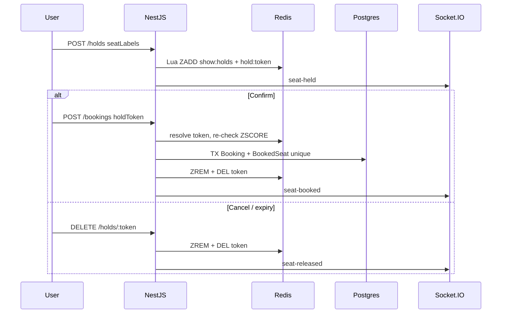

# BookMyShow — Core System Design

> **Audience:** Technical reviewer evaluating seat **hold**, **booking**, real-time updates, and the conversational booking agent.  


---

## 1. Executive summary

BookMyShow is a **two-package monorepo** (`backend/` NestJS API + `frontend/` Next.js app) that implements a full ticketing flow:

1. Browse movies and showtimes  
2. Select seats on a live seat map  
3. **Hold** seats for a bounded time (default **10 minutes**) — entirely in Redis  
4. Confirm into a **booking** — sparse `BookedSeat` rows in Postgres  
5. Optionally **cancel** holds or confirmed bookings  

**Key architectural choices (post-refactor):**

- **No `Seat` / `ShowSeat` pre-fill.** Screen layout lives as JSON (`layoutConfig`) on `Screen`. Seat lists are computed at read time via `computeSeatsForScreen(layoutConfig, basePrice)`.
- **No `Reservation` table.** Holds live only in Redis (sorted set + hold token).
- **No reconciliation cron.** Expired holds are naturally invisible via `ZRANGEBYSCORE` (score = expiry ms). Lazy expiry — no cleanup job.
- **Postgres `@@unique([showId, seatLabel])` on `BookedSeat`** is the final correctness guarantee for confirmed bookings. Redis is the fast-path concurrency gate for holds.

We deliberately chose a **modular monolith** over microservices. Hold → book stays in one process with one Prisma transaction for booking and one Redis Lua script for atomic holds.

---

## 2. Monorepo layout

```
bookmyshow/
├── backend/
│   ├── src/
│   │   ├── catalog/       # Movies, theatres, shows; seat maps = computed
│   │   ├── hold/          # Redis sorted-set holds + hold tokens (POST /holds)
│   │   ├── booking/       # Confirm from holdToken, cancel booking
│   │   ├── realtime/      # Socket.IO gateway + emit helpers
│   │   ├── redis/         # Shared ioredis client
│   │   ├── agent/         # LLM loop, tools, session, enricher
│   │   └── auth/          # User upsert for checkout/agent
│   └── prisma/            # Schema, migrations, seed
├── frontend/              # Next.js App Router
└── docker-compose.yml     # Redis only (Postgres is external, e.g. Supabase)
```

---

## 3. Data model

### 3.1 What lives in Postgres

| Entity | Role |
|--------|------|
| `Screen.layoutConfig` | JSON rows: `{ row, seats, type, priceMultiplier }` — source of the seat map |
| `Show.basePrice` | Decimal; seat price = `basePrice * priceMultiplier` |
| `Booking` | Confirmed purchase (`status`, `totalPrice`, `idempotencyKey`) |
| `BookedSeat` | Sparse occupied seats: `(showId, seatLabel)` unique; denormalized `type` + `price` |

**Deleted:** `Seat`, `ShowSeat`, `Reservation`, `ReservationSeat`, `BookingSeat`.

### 3.2 Seat availability (computed, not stored)

```
availability =
  computeSeatsForScreen(screen.layoutConfig, show.basePrice)
    MINUS BookedSeat WHERE showId = X
    MINUS active Redis holds for show X
```

Statuses returned to clients: `AVAILABLE` | `HELD` | `BOOKED` (computed at read time).

### 3.3 Final correctness

- **Holds:** Redis Lua script — all-or-nothing `ZADD` across a batch; concurrent holds for the same `seatLabel` — exactly one wins.
- **Bookings:** Prisma transaction creates `Booking` + `BookedSeat` rows. Unique constraint `(showId, seatLabel)` rejects races past Redis; caught as Prisma `P2002` → **409 Conflict**.

---

## 4. Hold mechanism (Redis only)

### 4.1 Structures

1. **Sorted set** `show:{showId}:holds`  
   - member = `seatLabel` (e.g. `"A5"`)  
   - score = expiry epoch ms  

2. **Hash + TTL** `hold:token:{token}`  
   - fields: `showId`, `seatLabels` (JSON), `userId`, `expiresAt`  
   - used at confirm time to prove ownership  

### 4.2 `HoldService` API

- `tryHoldSeats(showId, seatLabels[], ttlSeconds)` — Lua: abort if any seat’s ZSCORE > now; else ZADD all with expiry. Returns boolean.
- `releaseSeats` / `getHeldSeats` — ZREM / ZRANGEBYSCORE `now +inf` (expired members invisible; **no cleanup job**).
- `createHold` / `releaseHold` — validate vs layout + BookedSeat, call Lua, issue token, emit socket events.
- `createHoldToken` / `resolveHoldToken` / `deleteHoldToken`.

### 4.3 Flows

**Hold (`POST /holds`):** validate labels → check not booked → Lua hold → token → `seat-held` events.

**Confirm (`POST /bookings` with `holdToken`):** resolve token → re-check seats still in sorted set → transaction create Booking + BookedSeat → release Redis → `seat-booked`.

**Cancel hold (`DELETE /holds/:token`):** resolve token → ZREM + delete token → `seat-released`.

**Cancel booking (`DELETE /bookings/:id`):** status `CANCELLED` → delete `BookedSeat` rows → `seat-released` (seat available again purely by absence from BookedSeat).

Default TTL: **600s**. Demo: `DEMO_FAST_HOLD=true` / `NEXT_PUBLIC_DEMO_FAST_HOLD=true` → 10s.

---

## 5. Why no cron?

Previously Redis mirrored Postgres `Reservation.expiresAt` and a cron drained expired rows. That duplicated truth and required a background worker.

Now:

- Holds **never write to Postgres**.  
- Expiry is the sorted-set score. Reads use `ZRANGEBYSCORE (now +inf`.  
- Booking time re-checks the hold; expired tokens return **410 Gone**.  
- Client countdown still releases holds early on close/expiry for UX.

---

## 6. WebSocket

Event names unchanged: `seat-held`, `seat-released`, `seat-booked`.  
Payload field renamed: `seatId` → `seatLabel`.  
Frontend `useShowSocket` refetches `['show-seats', showId]` on every event.

---

## 7. Agent

Same tool set (`holdSeats`, `confirmBooking`, `releaseHold`, `getSeatMap`, …).  
Internal plumbing uses `HoldService` / `BookingService.createFromHold`.  
`session.reservationId` is **repurposed as the hold token** (same session field, new semantics).  
Seat picker values are **seatLabels** (e.g. `"A5"`), not UUIDs.  
Enricher + system prompt updated accordingly; structure of UI rules unchanged.

---

## 8. Scalability notes

| Concern | Approach |
|---------|----------|
| Millions of show × seat combinations | No pre-filled rows; only BookedSeat grows with confirmed sales |
| Concurrent holds | Redis Lua atomicity per show sorted set |
| Concurrent confirm | Unique `(showId, seatLabel)` in Postgres |
| Orphaned Redis members | Harmless; invisible after score passes; optional opportunistic ZREMRANGEBYSCORE later |
| Multi-instance Socket.IO | Add Redis adapter when scaling Nest horizontally |

**Intentionally skipped:** Kafka, reservation microservice, CQRS seat read model, reconciliation cron.

---

## 9. Key files

| Topic | Path |
|-------|------|
| Schema | `backend/prisma/schema.prisma` |
| Seat computation | `backend/src/catalog/util/computeSeatsForScreen.ts` |
| Holds (Lua) | `backend/src/hold/service/hold.service.ts` |
| Booking from hold | `backend/src/booking/service/booking.service.ts` |
| Seat map composition | `backend/src/catalog/service/catalog.service.ts` |
| Agent tools | `backend/src/agent/tools/holdSeats.ts`, `confirmBooking.ts` |
| Concurrent hold test | `backend/src/hold/service/hold.concurrent.spec.ts` |
| Idempotency test | `backend/src/booking/booking-idempotency.integration.spec.ts` |

---

## 10. End-to-end diagram



---

## 11. Summary for the reviewer

- **No Seat / ShowSeat / Reservation tables** — seats from `layoutConfig`, holds in Redis only.  
- **No cron** — sorted-set scores + lazy reads.  
- **Postgres unique constraint** is the hard guarantee on confirm.  
- **Lua script** is the hard guarantee on hold races.  
- Agent and manual UI share the same Hold/Booking services.
